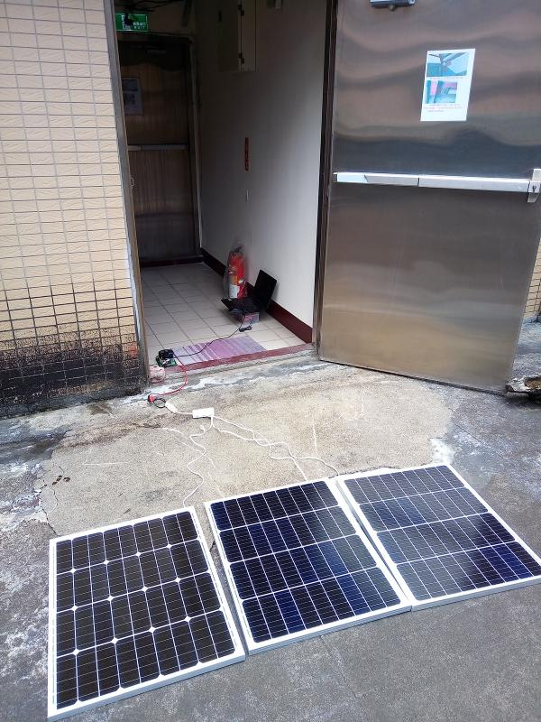

# PX100_solar_panel
Using PX100 to check power of solar panel
 
PX100 often was used to test battery. 
I wrote a tool to test quality of solar panel. 

   

Program. 
I run it ok with WinXP and Win7. 
   

PX100 comes with a USB to TTL232. Install it. 
   

Result.  
   

## Using Execl to analyze. 
If you get current more than solar panel ability, the voltage drops quickly. 
The value of current is variable and relative to strength of sun. 
 
   

Test 3 of 50W solar panel. 
Remember add a diode for voltage balance. 
   

PX100 takes 12v power. 
Using a Sb battery and a buck–boost converter to generate 12V.
   

